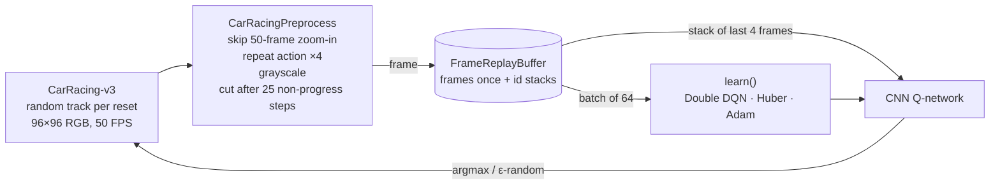

# CarRacing DQN (`games/car_racing/`)

Goal: a car that can drive a lap as fast as possible on **any** track. Gymnasium's `CarRacing-v3` builds a
new random closed-loop track on every `reset()`, so training across many episodes forces the agent to learn
*driving*, not one map. See [rl-vs-dl-concepts.md](rl-vs-dl-concepts.md) for the general DQN vocabulary.

```
python -m games.car_racing.train              # train (resumes from checkpoints/car_racing/latest.pt)
python -m games.car_racing.watch              # watch best.pt drive new random tracks
python -m games.car_racing.watch --seed 42    # fixed tracks, to compare checkpoints fairly
```

## What changed vs. LunarLander

| | LunarLander (`games/lunar_lander/`) | CarRacing (`games/car_racing/`) |
|---|---|---|
| State | 8 numbers | 4 stacked 96×96 grayscale frames |
| Model | MLP 8→128→128→4 | CNN (Atari DQN: 3 conv + 512 fc) → 5 |
| Actions | noop, left, main, right engine | noop, right, left, gas, brake |
| Replay buffer | 100k transitions as float arrays | 100k **frames** stored once, transitions point to frame ids (~0.9 GB) |
| Target | DQN | Double DQN (online net picks next action, target net scores it) |
| Device | CPU | MPS (Apple GPU) if available |
| "Solved" | avg100 ≥ 200 | avg100 ≥ 900 |

## Pipeline



## Where "fastest lap" comes from

The environment reward is **+1000/N per new track tile** and **−0.1 per frame**; leaving the map is −100.
Finishing the lap in fewer frames therefore scores higher (a 732-frame lap = 1000 − 73.2 = 926.8).
The 1000-frame time limit adds more pressure: a slow car never finishes. Lap time is logged as
`frames driven / 50` seconds whenever the env reports `lap_finished`.

The time pressure is fairly weak (200 frames faster ≈ +20 return). To push harder for speed, raise the
per-frame penalty in a `RewardWrapper`, or add a bonus proportional to how early the lap is finished.

## Design choices worth knowing

- **Frame stacking**: one frame shows position but not speed or direction; 4 frames let the CNN infer motion.
- **Frame skip 4**: the agent decides 12.5 times/second, which gives 4× fewer decisions, and each action has a visible effect.
- **Early cut on the grass** (`max_neg_steps`): an episode with 25 decisions in a row without new tiles is
  *truncated*, not *terminated*, so it doesn't teach "the future is worth 0 here". `watch.py` turns this off.
- **Frame-id replay buffer**: storing both `s` and `s'` as 4-frame stacks would take 8× the memory.
- **Generalisation check**: training returns are measured on random tracks the agent has never seen, so avg100
  is already a held-out score. Use `python -m games.car_racing.watch --seed N` for repeatable comparisons.

## Expected cost

On an M4 Pro: about 60 decisions/s end to end (about 150 gradient steps/s on MPS). 1000 episodes take roughly 1–2 hours.
Full checkpoints include the replay buffer, so `latest.pt` grows to about 1.6 GB (kept out of git, see `.gitignore`).

## Next steps if it plateaus

- Continuous control (steer, gas and brake together) with SAC/PPO. Discrete DQN can't brake and turn at once.
- Stronger time reward (see above) to trade safety for pace.
- `domain_randomize=True` for random colours, so the agent doesn't rely on the exact grass and road colours.
- Your own tracks: subclass `CarRacing` and override `_create_track()` to load a list of `(x, y)` points.
