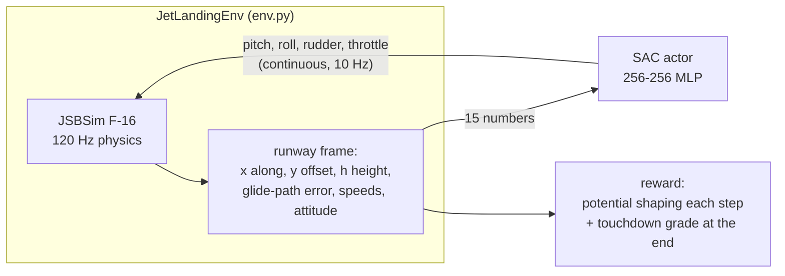

# Jet landing (`games/jet_landing/`, SAC)

An F-16 on a randomised final approach must follow the 3° glide path, flare and touch down gently on the runway.
Physics is [JSBSim](https://github.com/JSBSim-Team/jsbsim), the flight dynamics engine behind FlightGear. It's
used directly rather than through jsbgym (see "Why not jsbgym" below).

```
python -m games.jet_landing.autopilot              # watch the hand-written autopilot (baseline)
python -m games.jet_landing.autopilot --runs 200   # headless baseline stats
python -m games.jet_landing.train                  # train SAC (resumes automatically)
python -m games.jet_landing.watch                  # watch the best SAC pilot
```

## The task



| | |
|---|---|
| Start (per episode) | 0.4–8 km out (the upper end scaled by `difficulty`); up to ±60 m above/below the path, ±150 m offset and ±15° heading, scaled by difficulty and by distance (no offsets at 400 m, full from ~3.4 km); 145–165 kt, wind 0–10 kt from any direction, random runway heading |
| Start state | Trimmed for a steady 3° descent, so centred controls mean "keep descending like this" |
| Observation | 15 values in the runway frame, roughly normalised (`STATE_LABELS` in `env.py`) |
| Action | 4 continuous values in [-1, 1]: pitch stick (the F-16's fly-by-wire turns it into a g-command), roll stick, rudder, scaled to 50 % / 50 % / 20 % of full deflection (`CONTROL_LIMITS`); throttle idle..full military power (no afterburner) |
| Step | 0.1 s (12 physics steps) |
| Ends | first ground contact, loss of control (>60° bank or >25° alpha), missed approach (past the runway end, >1.5 km off, >1 km high), or 180 s |

### Reward

- **Every step:** the change in a potential, `Φ(s') − Φ(s)`, where Φ is minus a weighted sum of glide-path error,
  centreline offset, heading error, airspeed error, bank, and distance floated past the touchdown zone (each term capped at 20). It points the agent toward a
  good approach and adds up to exactly `Φ(end) − Φ(start)` over an episode, so it can't be farmed.
  It's deliberately *not* the textbook `γ·Φ(s') − Φ(s)`: with Φ ≤ 0 that pays `(1−γ)·|Φ|` every step, a bonus that
  grows with distance off course. Run 3 showed critic values of +25 while episodes returned −95.
- **At touchdown:**

| Outcome | Reward |
|---|---|
| landed | 100 − 4·(sink − 3 ft/s)⁺ − 30·(offset / half width) − 20·min(1, distance from aim point / 600 m) |
| landed off runway | −60 |
| crash: airframe contact, nose gear first, sink > 12 ft/s or bank > 12° | −100 |
| lost control | −100 |
| missed approach | −100 (as bad as a crash, otherwise flying away beats trying) |
| timeout | 0 (truncated, not terminated) |

## Baseline: hand-written autopilot

`autopilot.py` is a set of proportional and integral control rules: steer the ground track back to the
centreline, follow the glide path's sink rate with an integral term (the F-16 stick commands g-load, so P alone
leaves a steady error), flare from 6 m, idle at 5 m. Measured on 200 unseen approaches:

| Wind | Landed | Sink | Touchdown | Centreline |
|---|---|---|---|---|
| 0–10 kt | 200/200 | 4.1 ft/s (max 5.3) | 328 ± 4 m past threshold | 1.8 m (max 10) |
| 0–20 kt | 200/200 | 4.0 ft/s (max 6.6) | 329 ± 6 m | 1.9 m (max 9) |

Episode return ≈ 94. This is the bar for SAC. The autopilot knows the answer's structure; SAC has to discover it
from reward alone.

## Training (SAC)

- `rl/sac.py`: twin critics with soft-updated targets, a tanh-squashed Gaussian actor, and an automatically tuned
  entropy temperature α. The replay buffer is the same `ReplayBuffer` as LunarLander, storing float action vectors.
- **Curriculum:** `difficulty` starts at 0: 400 m from the threshold, on the glide path, a few seconds before
  touchdown. It goes up by 0.1 each time the last 50 episodes at the current level have a ≥ 70 % landing rate.
  Difficulty 1 means up to 8 km out, ±60 m off the path, ±150 m offset, ±15° heading. Starting that close matters.
  Earlier runs began ≥ 2 km out, where an untrained policy never survived to the runway (0 landings in 1,000
  random-action episodes). The replay buffer held no landings, the critics never learned what success is worth, and
  the curriculum never left its first level. From 400 m, random actions land 4 % of the time, and that's enough to learn from.
- **Evaluation:** every 25 episodes the deterministic actor flies the same 20 full-difficulty approaches.
  `best.pt` is the actor with the best mean return there. Training returns aren't comparable across curriculum levels.
- **Speed:** the env runs at ~10k steps/s. SAC updates run at ~560/s single-threaded on CPU, which is faster than
  multi-threaded and much faster than MPS for 256-unit networks, hence `torch_threads = 1`. That's roughly 30–40 min
  per million steps.

Log columns: `landed100` = landings in the last 100 training episodes, `alpha` = entropy temperature (falls as
the policy commits), `q` = the critics' average value estimate (a sanity check: it should stay bounded, roughly
within ±150).

## Rendering

`render.py` draws with pygame into an RGB array (~5 ms/frame), so the shared `rl/viewer.py` window shows it with
the info panel. The top half is a chase camera with ground grid, runway markings, glide-path gates every 500 m,
and an F-16 wireframe with its ground shadow. The bottom half shows a side profile and a top-down view with the
flown trail. FlightGear could be added later for real 3D replays, but it isn't needed for training or debugging.

## Implementation notes

- **A fresh JSBSim instance every episode** (2–3 ms). Reusing one leaked state across episodes: after ~280
  episodes the jet had burned 3,000 lb of fuel, flamed out, and every trim failed.
- **Wind is applied after trimming**, because JSBSim's trim clears it. The aircraft feels it as a gust at the start.
- **Limited control authority** (`CONTROL_LIMITS`). The first SAC run used full stick. Its exploring policy pulled
  up to 9 g and rolled at full rate, so ~90 % of early episodes ended in "lost control" within seconds, and after
  56k steps it hadn't landed once. The autopilot's commands stay under 0.42 pitch / 0.17 roll 99 % of the time,
  so capping at 0.5 / 0.5 (rudder 0.2) costs nothing a landing needs. The autopilot still lands 200/200.
- **No cheap way out.** In the second run the agent found a loophole. A missed approach cost −50 against −100 for a
  crash, and the shaping terms were capped at 3 (everything beyond ~150 m off course looked equally bad). So it
  dove to 350 kt and left sideways at 1.5 km. Now a missed approach costs −100, and the terms are capped at 20.
- **No floating.** Run 5 learned to flare at the easiest level, then skimmed a few metres above the runway to its
  end. The glide-path term is ~0 there, and the missed-approach penalty ~300 steps later is discounted to ~−5.
  The potential now also counts distance floated beyond 100 m past the aim point (autopilot touchdowns at 328 m
  are inside the free zone).
- **Throttle** `fcs/throttle-cmd-norm` 0–0.5 is idle to full military power on this model. Above 0.5 is afterburner, which is excluded.
- **Contacts:** gear units 0–2 (`gear/unit[i]/WOW`), structure points 3–9 (`contact/unit[i]/WOW`: wingtips, tail,
  ventral fins, intake, radome).

## Why not jsbgym

jsbgym (0.4.3) wraps the same JSBSim, but its tasks have no throttle, raise the gear on reset, and have no runway.
New tasks must also go through its reward framework (`Assessor`, `RewardComponent`). Adding landing there would
override most of it, so a ~300-line env on raw `jsbsim` is simpler and fully under our control.

## Running it yourself: what to expect

```
python -m games.jet_landing.train              # pure SAC; resume any time, Ctrl+C saves
python -m games.jet_landing.train --fresh --demos 200 --name demos   # variant seeded with autopilot flights
python -m games.jet_landing.watch              # or --checkpoint checkpoints/jet_landing/latest.pt
```

- **What progress looks like:** first `landed100` rising at difficulty 0, then `curriculum -> difficulty 0.10` lines,
  and eventually EVAL landings at full difficulty. Early runs (~100k steps) learned to flare gently at difficulty 0
  and produced the first full-difficulty landing, but hadn't yet passed the 70 % bar for the first curriculum step.
  Expect this to need several hundred thousand to a few million steps (≈ 45 min per million on an M4 Pro).
- **Warning signs:** `q` far above anything the returns support (e.g. +50 while avg100 is −100) means the
  critics are over-optimistic. A new outcome suddenly dominating (floating, flying away) usually means the agent
  found a reward loophole; see the implementation notes for the ones already closed.
- **Demonstrations (`--demos`)** didn't help in two short trials. Plain SAC's critics learn the autopilot's
  (good) action values, and the actor, which never imitates, inherits that optimism (Q ≈ +90 at returns ≈ −117).
  Making demos useful needs an imitation term in the actor loss (e.g. behaviour cloning on demo transitions).
- **Knobs worth trying first:** `promote_rate` (0.7 may be strict), `CONTROL_LIMITS`, the potential weights in
  `_potential()`, `AGENT_HZ` (5 Hz halves the horizon the critics must see across).
