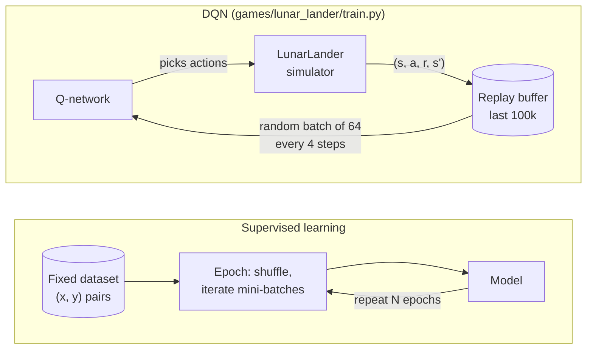
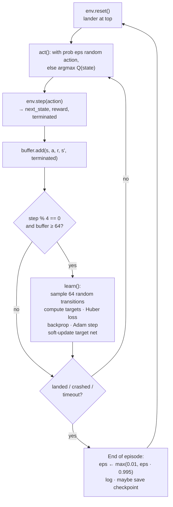

# DQN in this repo, explained in ML / Deep Learning terms

How the LunarLander DQN (`games/lunar_lander/train.py` + `rl/`) maps onto familiar supervised-learning vocabulary, and where it differs.

**TL;DR**

- **Episode** = one landing attempt (reset → land / crash / fly away / 1000-step timeout).
- **There is no epoch.** There is no fixed dataset to pass over; the agent generates its own data while playing.
- **The model is never retrained from scratch.** One network is nudged by one gradient step every 4 simulator frames, *during* episodes, using random past experience.

---

## 1. Glossary: code term → ML/DL equivalent

| Code term | Meaning in LunarLander | ML / DL equivalent |
|---|---|---|
| `state` (8 floats) | x, y, vel x, vel y, angle, angular vel, left leg, right leg | **Input features** `x` |
| `action` (0–3) | noop, fire left, fire main, fire right | **Output class**, but no ground-truth label exists |
| `reward` | Points for one frame (+ landing, − crash, − fuel) | Weak, delayed **supervision signal** |
| `episode_return` | Sum of rewards over one attempt | Score / metric you monitor |
| `MLPQNetwork` (`rl/networks.py:7`) | Predicts value of each of the 4 actions | **The model** — MLP 8 → 128 → 128 → 4 |
| `ReplayBuffer` (`rl/buffers.py:6`) | Last 100k transitions `(s, a, r, s', done)` | **The dataset**, but growing and sliding (FIFO) |
| `buffer.sample(64)` | 64 random past transitions | **Mini-batch** (shuffled DataLoader) |
| `target = r + γ·max Q_target(s')` (`rl/dqn.py:37`) | "What this action should have been worth" | **Labels `y`**, produced by the model itself (bootstrapping) |
| `F.smooth_l1_loss` (`rl/dqn.py:39`) | | **Loss function** (Huber → regression) |
| `optimizer.step()` (`rl/dqn.py:42`) | | **One gradient-descent step** (Adam, lr 5e-4) |
| `agent.target` + `tau` (`rl/dqn.py:47`) | Slow-moving copy of the Q-network | Like an **EMA of weights**; keeps labels stable |
| `eps` (epsilon) | Probability of a random action | **Exploration** — a data-collection policy, no DL analogue |
| `step` | One simulator frame | One new data point collected |
| `episode` | One full attempt (≤ 1000 steps) | No direct analogue — *not* an epoch |
| `checkpoints/lunar_lander/best.pt` | Weights with best 100-episode average return | **Best model by validation metric** |
| `checkpoints/lunar_lander/latest.pt` | Full training state (weights, optimizer, buffer, RNG) | **Resumable training checkpoint** |

---

## 2. Supervised learning vs. this DQN



| | Supervised learning | DQN here |
|---|---|---|
| Data | Fixed, collected beforehand | Generated by the model itself, while training |
| Data distribution | Stationary | Shifts as the pilot improves |
| Labels | Given | Computed from reward + the target network |
| Unit of progress | Epoch | Environment step / episode |
| Training cadence | Loop over dataset N times | 1 gradient step every 4 frames, forever |

---

## 3. What happens inside one episode



Code: inner loop is `games/lunar_lander/train.py:79-90`, end-of-episode bookkeeping is `games/lunar_lander/train.py:92-112`; `act()` and `learn()` live in `rl/dqn.py`.

---

## 4. Timeline: learning happens *during* the attempt

```
frames:     1   2   3   4   5   6   7   8   9  10  11  12 ...  (episode k)  | reset |  1   2   3   4 ... (episode k+1)
collect:    ●   ●   ●   ●   ●   ●   ●   ●   ●   ●   ●   ●                   |       |  ●   ●   ●   ●
learn():                ▲               ▲               ▲                   |       |              ▲
                        └─ 1 gradient step on 64 random transitions from ANY earlier episode
eps:        ─────────────── constant within the episode ───────────────     | ×0.995|  ──────────────
```

- The lander at frame 500 is flown by slightly different weights than at frame 1.
- Each `learn()` batch mixes experience from many past episodes, which breaks the correlation between consecutive frames (the RL version of "shuffle=True").

---

## 5. "Where is the epoch?" — the closest analogues

There is no pass over a fixed dataset, so no epoch. Useful counters instead:

| Quantity | Value in this config |
|---|---|
| Gradient steps per `learn()` call | 1 (batch of 64) |
| Environment steps per gradient step | 4 (`learn_every`) |
| Steps per episode | ~100–1000 |
| Gradient steps per episode | ~25–250 |
| Episodes (default) | 2000 |
| Total gradient steps | a few hundred thousand |

If you must think in epochs: a rough "replay ratio" is *each stored transition is sampled about 64 / 4 = 16 times on average during its lifetime in the buffer*.

---

## 6. Do we retrain the model after every attempt?

No.

- **Same network the whole run** — updated incrementally (online learning). Nothing is reset between episodes; resuming from `latest.pt` even restores the optimizer and replay buffer.
- **Updates happen mid-episode**, not after it.
- **Per-episode changes** are only: epsilon decay (`games/lunar_lander/train.py:95`), logging, `best.pt` / `latest.pt` saving.

One-liner: supervised learning is *fixed data → many epochs → model*; this DQN is a loop of *model plays → produces data → a few gradient steps on random old data → slightly better model plays*, repeated for ~2000 episodes.
